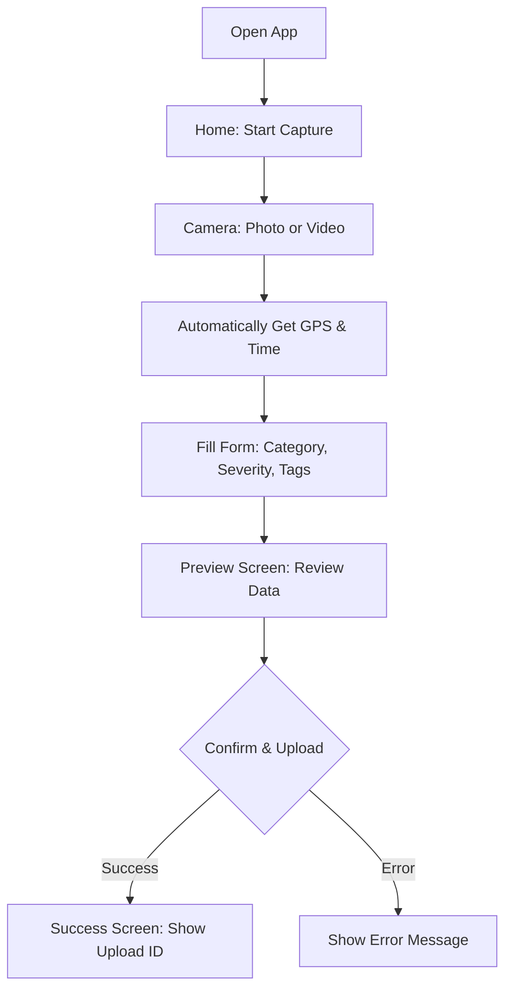
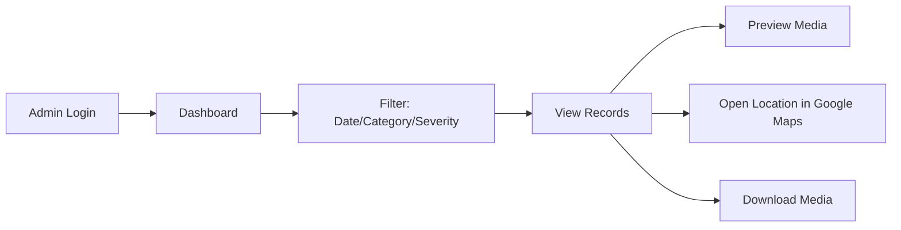
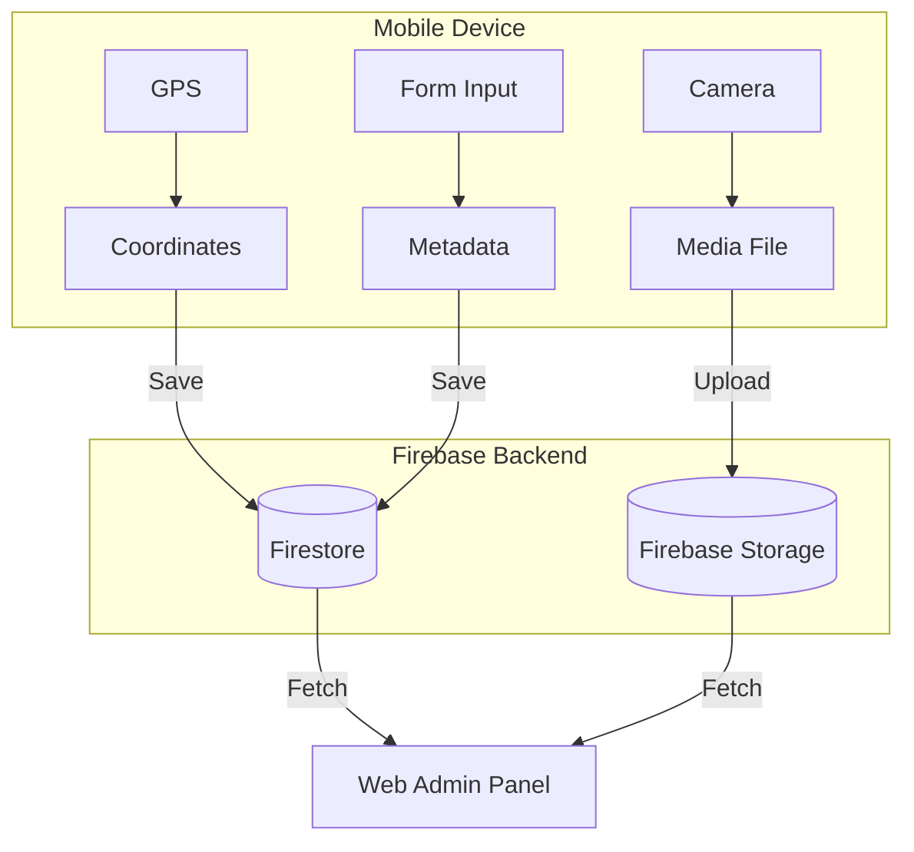

# System Infographics

## a) User Flow (Mobile App)

From opening the app to final confirmation.



---

## b) Admin Flow (Web Panel)

Secure management and data review.



---

## c) Data Flow Architecture

Communication between device and cloud.



---

## d) Quick Reference (ASCII)

```text
+-----------------------+       +-----------------------+
|   MOBILE USER APP     |       |   ADMIN WEB PANEL      |
+-----------------------+       +-----------------------+
| [Camera] -> [Form]    | ----> | [Filters] -> [List]   |
| [GPS]    -> [Upload]  |       | [Analytics] -> [Export]|
+-----------------------+       +-----------------------+
           |                             ^
           v                             |
+-------------------------------------------------------+
|                 FIREBASE BACKEND                      |
+-------------------------------------------------------+
|  [Auth]      [Firestore]      [Storage]    [Hosting]  |
+-------------------------------------------------------+
```
