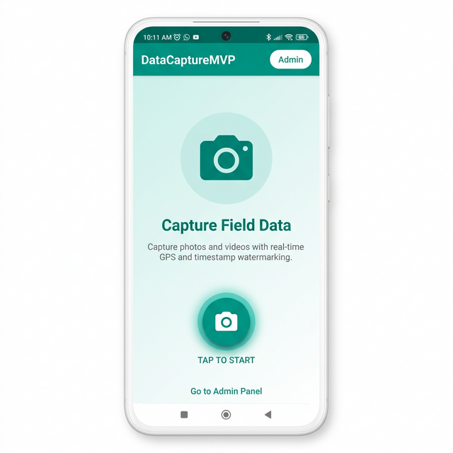
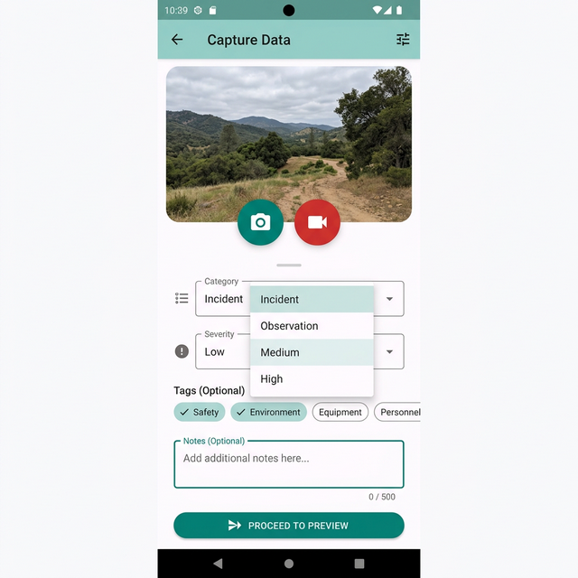
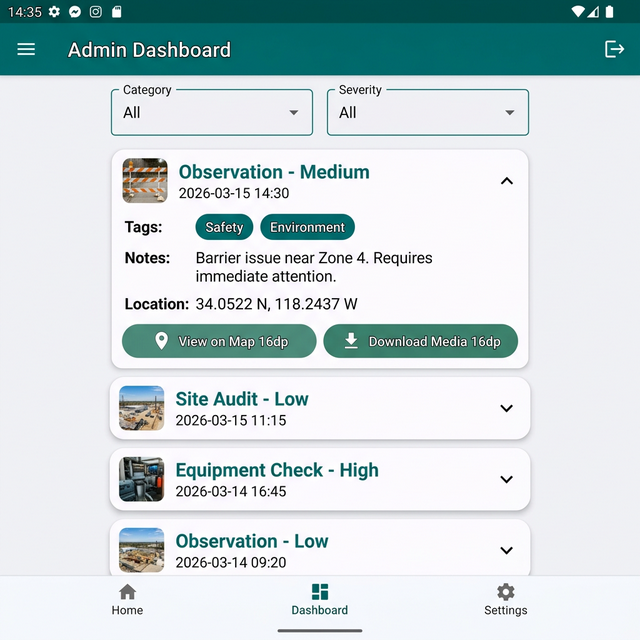
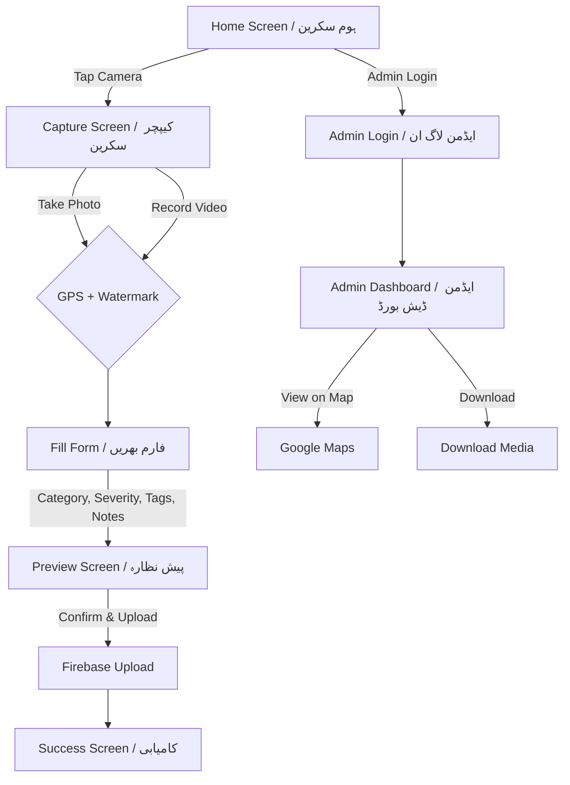

# 📱 DataCaptureMVP — پروجیکٹ کی مکمل تفصیل / Complete Project Description

---

## 🇵🇰 اردو میں تعارف

### پروجیکٹ کا نام
**DataCaptureMVP** — موبائل ڈیٹا کیپچر ایپلیکیشن

### مقصد
یہ ایک **Flutter** پر بنائی گئی موبائل ایپلیکیشن ہے جو فیلڈ ڈیٹا اکٹھا کرنے کے لیے ڈیزائن کی گئی ہے۔ اس ایپ کے ذریعے آپ:

- 📸 **فوٹو اور ویڈیو** کیپچر کر سکتے ہیں (کیمرہ یا گیلری سے)
- 📍 **GPS لوکیشن** خودکار طریقے سے ریکارڈ ہوتی ہے (عرض البلد اور طول البلد)
- 🔖 **واٹر مارک** خودکار طور پر فوٹو/ویڈیو پر لگایا جاتا ہے (GPS + ٹائم اسٹیمپ)
- 🏷️ **زمرہ بندی** کر سکتے ہیں (واقعہ، مشاہدہ، دیکھ بھال، دیگر)
- ⚠️ **شدت** کی سطح منتخب کر سکتے ہیں (کم، درمیانی، زیادہ)
- 📝 **ٹیگز اور نوٹس** شامل کر سکتے ہیں
- ☁️ **Firebase** پر ڈیٹا اپلوڈ ہوتا ہے (تصاویر، ویڈیوز، اور میٹا ڈیٹا)
- 👤 **صارف کی توثیق** — عام صارفین بغیر نام لاگ ان، ایڈمن ای میل/پاسورڈ سے
- 📊 **ایڈمن ڈیش بورڈ** — تمام اپلوڈز دیکھیں، فلٹر کریں، نقشے پر مقام دیکھیں، میڈیا ڈاؤنلوڈ کریں

### 📱 سکرین شاٹس / Screenshots

| ہوم سکرین / Home | کیپچر سکرین / Capture | ایڈمن ڈیش بورڈ / Admin |
|:---:|:---:|:---:|
|  |  |  |

### استعمال کے مواقع
- فیلڈ ڈیٹا اکٹھا کرنا (انسپیکشن، سروے)
- واقعات کی رپورٹنگ
- مشاہدات کی ریکارڈنگ
- دیکھ بھال کے ریکارڈز

### پروجیکٹ کا ڈھانچہ
```
DataCaptureMVP/
├── lib/
│   ├── main.dart                    # ایپ کا مرکزی فائل
│   ├── models/
│   │   └── upload_model.dart        # ڈیٹا ماڈل
│   ├── screens/
│   │   ├── home_screen.dart         # ہوم سکرین
│   │   ├── capture_screen.dart      # میڈیا کیپچر سکرین
│   │   ├── preview_screen.dart      # پیش نظارہ اور اپلوڈ
│   │   ├── success_screen.dart      # کامیابی کا پیغام
│   │   ├── admin_login_screen.dart  # ایڈمن لاگ ان
│   │   └── admin_dashboard_screen.dart  # ایڈمن ڈیش بورڈ
│   ├── services/
│   │   ├── firebase_service.dart    # Firebase آپریشنز
│   │   ├── media_service.dart       # کیمرہ/گیلری سروس
│   │   ├── location_service.dart    # GPS لوکیشن سروس
│   │   └── watermark_service.dart   # واٹر مارک سروس
│   └── scripts/
│       └── generate_logo.dart       # لوگو جنریشن
├── assets/
│   └── logo.png                     # ایپ آئیکون
├── DOCS/                            # دستاویزات
├── android/                         # اینڈرائیڈ پلیٹ فارم
├── ios/                             # iOS پلیٹ فارم
├── web/                             # ویب پلیٹ فارم
└── pubspec.yaml                     # ڈیپنڈنسیز
```

---

## 🇬🇧 English Description

### Project Name
**DataCaptureMVP** — Mobile Data Capture Application

### Purpose
DataCaptureMVP is a **production-ready MVP** built with **Flutter** for capturing field data — photos and videos — enriched with automatic GPS location tagging, real-time watermarking, categorization, and metadata. It includes both a **Mobile App** for field agents and a **Web Admin Dashboard** for supervisors.

### Key Features

| Feature | Description |
|---|---|
| 📸 Media Capture | Take photos & videos via camera or gallery |
| 📍 GPS Tagging | Automatic high-precision GPS coordinates |
| 🔖 Watermarking | GPS + Timestamp overlay on media |
| 🏷️ Categorization | Incident, Observation, Maintenance, Other |
| ⚠️ Severity Levels | Low, Medium, High |
| 📝 Tags & Notes | Custom tags and descriptive notes |
| ☁️ Cloud Upload | Firebase Storage + Firestore |
| 👤 Authentication | Anonymous (users) + Email/Password (admin) |
| 📊 Admin Dashboard | View, filter, map, download all uploads |
| 🗺️ Google Maps | View capture locations on map |

### 📱 App Screenshots

| Home Screen | Capture Screen | Admin Dashboard |
|:---:|:---:|:---:|
|  |  |  |

### Technology Stack

| Technology | Purpose |
|---|---|
| **Flutter** | Cross-platform mobile/web framework |
| **Dart** | Programming language |
| **Firebase Auth** | User authentication (Anonymous + Email) |
| **Cloud Firestore** | NoSQL database for metadata |
| **Firebase Storage** | Store photos and videos |
| **Geolocator** | GPS location services |
| **Image Picker** | Camera and gallery access |
| **Watermark Kit** | Video watermarking |
| **Image (Dart)** | Image processing & text overlay |
| **Provider** | State management |
| **GoRouter** | Declarative routing/navigation |
| **URL Launcher** | Open Google Maps & download links |
| **Intl** | Date/time formatting |
| **Path Provider** | Temporary file storage paths |

### Application Flow



### Prerequisites / ضروریات

- **Flutter SDK** 3.0.0 یا اس سے اوپر / or higher
- **Android Studio** یا **VS Code**
- **Firebase** اکاؤنٹ / account
- **Android** ڈیوائس یا ایمولیٹر / device or emulator

### Quick Start / فوری آغاز

```bash
# 1. Clone the repository / ریپوزٹری کلون کریں
git clone https://github.com/zeeshansarwar1986/DataCapture-MVP-1.git
cd DataCapture-MVP-1

# 2. Install dependencies / ڈیپنڈنسیز انسٹال کریں
flutter pub get

# 3. Run the app / ایپ چلائیں
flutter run

# 4. Build APK / APK بنائیں
flutter build apk --release
```

### Firebase Configuration / Firebase ترتیب

1. [Firebase Console](https://console.firebase.google.com) پر جائیں
2. نیا پروجیکٹ بنائیں: `DataCaptureMVP`
3. Authentication فعال کریں (Anonymous + Email/Password)
4. Firestore Database بنائیں
5. Firebase Storage فعال کریں
6. `google-services.json` ڈاؤنلوڈ کر کے `android/app/` میں رکھیں

### Android Permissions / اینڈرائیڈ اجازتیں

- `INTERNET` — نیٹ ورک رسائی
- `ACCESS_FINE_LOCATION` — GPS لوکیشن
- `ACCESS_COARSE_LOCATION` — نیٹ ورک لوکیشن
- `CAMERA` — کیمرہ رسائی
- `READ_EXTERNAL_STORAGE` — گیلری رسائی
- `WRITE_EXTERNAL_STORAGE` — فائل اسٹوریج

---

## ✅ ایپ کے فائدے / App Benefits & Advantages

### 🇵🇰 اردو میں فائدے

| # | فائدہ | تفصیل |
|---|---|---|
| 1 | ⏱️ **وقت کی بچت** | فوٹو، لوکیشن، اور ٹائم اسٹیمپ ایک کلک میں — کاغذی کام ختم |
| 2 | 📍 **ثبوت کے ساتھ ڈیٹا** | GPS اور واٹر مارک سے ہر ریکارڈ مستند اور ناقابل تردید |
| 3 | ☁️ **کلاؤڈ بیس** | ڈیٹا کبھی ضائع نہیں ہوتا — Firebase پر محفوظ |
| 4 | 📊 **ریئل ٹائم مانیٹرنگ** | ایڈمن ڈیش بورڈ سے فوری طور پر ڈیٹا دیکھیں |
| 5 | 🔒 **محفوظ** | Firebase Authentication سے صارفین محفوظ |
| 6 | 📱 **کراس پلیٹ فارم** | اینڈرائیڈ، iOS، اور ویب — ایک ہی کوڈ |
| 7 | 🏷️ **منظم ڈیٹا** | زمرہ، شدت، ٹیگز سے آسان تلاش |
| 8 | 💰 **کم لاگت** | Firebase فری ٹیئر کافی ہے — سرور خریدنے کی ضرورت نہیں |
| 9 | 🔄 **آسان تبدیلی** | اوپن سورس — کوئی بھی ڈویلپر ایڈٹ کر سکتا ہے |
| 10 | 🗺️ **نقشے پر ٹریکنگ** | ہر ریکارڈ کا مقام Google Maps پر فوراً دیکھیں |

### 🇬🇧 Benefits in English

| # | Benefit | Description |
|---|---|---|
| 1 | ⏱️ **Time Saving** | One-tap capture with auto GPS + timestamp — eliminates paperwork |
| 2 | 📍 **Verified Evidence** | GPS watermark on every photo/video — tamper-proof records |
| 3 | ☁️ **Cloud-Based** | Data never lost — stored securely on Firebase |
| 4 | 📊 **Real-Time Monitoring** | Admin dashboard shows all uploads instantly |
| 5 | 🔒 **Secure** | Firebase Authentication protects all data |
| 6 | 📱 **Cross-Platform** | Android, iOS, and Web — single codebase |
| 7 | 🏷️ **Organized Data** | Category, severity, tags make data searchable |
| 8 | 💰 **Cost-Effective** | Firebase free tier is sufficient — no server costs |
| 9 | 🔄 **Easy Customization** | Open source — any developer can modify |
| 10 | 🗺️ **Map Tracking** | View exact location of every record on Google Maps |

### استعمال کے شعبے / Use Cases

- 🏗️ **تعمیراتی مقامات** — سائٹ انسپیکشن اور ترقی کی رپورٹنگ
- 🏭 **فیکٹریز** — آلات کی دیکھ بھال اور حفاظتی واقعات کی ریکارڈنگ
- 🌾 **زراعت** — فصلوں کی نگرانی اور فیلڈ سروے
- 🏛️ **سرکاری ادارے** — انسپیکشن اور مانیٹرنگ
- 🏥 **صحت** — فیلڈ ہیلتھ ورکرز کی رپورٹنگ
- 🛣️ **انفراسٹرکچر** — سڑکوں اور عمارتوں کی حالت کی رپورٹنگ

---

**Author / مصنف**: Zeeshan  
**License / لائسنس**: MIT  
**Repository**: [github.com/zeeshansarwar1986/DataCapture-MVP-1](https://github.com/zeeshansarwar1986/DataCapture-MVP-1)
