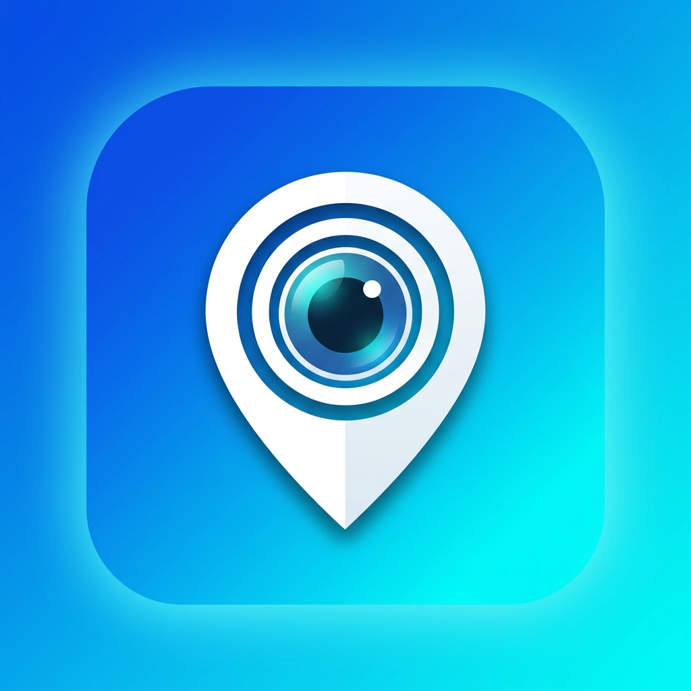
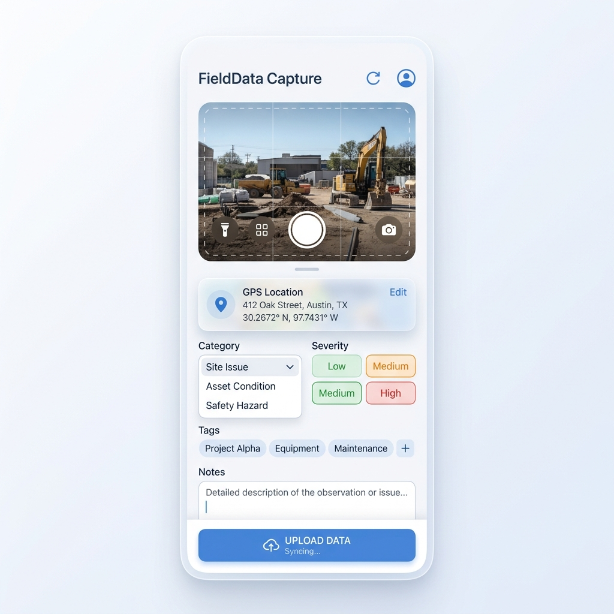

# DataCaptureMVP - Mobile Data Capture Application

<div align="center">
  
</div>

[](https://flutter.dev)
[](https://firebase.google.com/)

<div align="center">
  
</div>

A comprehensive, production-ready Flutter mobile application designed for seamless field data collection. It allows users to capture photos and videos, automatically attaching real-time GPS coordinates, timestamps, and custom metadata (such as categories, severities, and notes). The app includes an anonymous user flow for quick data entry and a secure Admin Dashboard for monitoring, filtering, and managing all submitted reports, complete with Google Maps integration. 

This repository is designed with clean architecture and scalability in mind, making it an excellent starting point for international developers looking to build field-service, inspection, or incident-reporting applications.

---

## 🌍 Features (English)

- 📸 **Media Capture**: Take high-quality photos and videos directly from the camera or select them from the device gallery.
- 📍 **GPS Location Tagging**: Automatically pinpoint and securely record precise GPS coordinates for each incident or capture.
- 🏷️ **Categorization**: Systematically organize captures by predefined 'Category' and 'Severity' levels.
- 🔖 **Tags & Notes**: Append custom tags and descriptive notes to provide critical context for each record.
- ⏰ **Automated Timestamps**: Every record is securely timestamped to ensure data integrity and trackability.
- 👤 **User Authentication**: Frictionless anonymous login for on-the-ground field operators; secure Email/Password protection for dashboard admins.
- 📊 **Admin Dashboard**: A centralized, real-time hub to view, filter, and manage all incoming data streams.
- 🗺️ **Google Maps Integration**: Visually track and locate captures via interactive map markers.
- ⬇️ **Media Download**: Seamlessly download attached media files for offline use, auditing, or reporting.

---

## 🇵🇰 خصوصیات (Urdu)

- 📸 **میڈیا کیپچر**: کیمرے سے اعلیٰ معیار کی تصاویر اور ویڈیوز بنائیں یا گیلری سے منتخب کریں۔
- 📍 **جی پی ایس لوکیشن ٹیگنگ**: ہر تصویر/ویڈیو کے ساتھ خودکار طور پر درست جی پی ایس کوآرڈینیٹس محفوظ کریں۔
- 🏷️ **زمرہ بندی**: ڈیٹا کو 'کیٹیگری' اور 'شدت' (Severity) کے لحاظ سے ترتیب دیں۔
- 🔖 **ٹیگز اور نوٹس**: تفصیلی معلومات کے لیے کسٹم ٹیگز اور نوٹس شامل کریں۔
- ⏰ **خودکار ٹائم سٹیمپس**: ہر ریکارڈ کے ساتھ تاریخ اور وقت کی خودکار طور پر محفوظیت۔
- 👤 **یوزر آتھنٹیکیشن**: فیلڈ ورکرز کے لیے آسان گمنام لاگ ان اور ایڈمنز کے لیے محفوظ ای میل/پاس ورڈ لاگ ان۔
- 📊 **ایڈمن ڈیش بورڈ**: تمام ڈیٹا کو دیکھنے، فلٹر کرنے اور منظم کرنے کے لیے ایک مرکزی پینل۔
- 🗺️ **گوگل میپس انٹیگریشن**: نقشے پر کیپچر کی گئی لوکیشنز کو باآسانی دیکھیں۔
- ⬇️ **میڈیا ڈاؤن لوڈ**: آف لائن استعمال یا رپورٹنگ کے لیے میڈیا فائلز ڈاؤن لوڈ کریں۔

---

## 🇸🇦 المميزات (Arabic)

- 📸 **التقاط الوسائط**: التقاط صور ومقاطع فيديو عالية الجودة مباشرة من الكاميرا أو الاختيار من المعرض الخاص بالجهاز.
- 📍 **تحديد الموقع الجغرافي (GPS)**: تسجيل إحداثيات GPS الدقيقة تلقائيًا وبأمان لكل صورة أو فيديو.
- 🏷️ **التصنيف**: تنظيم البيانات بدقة حسب "الفئة" ومستوى "الخطورة".
- 🔖 **العلامات والملاحظات**: إضافة علامات مخصصة وملاحظات وصفية لتوضيح السياق لكل سجل.
- ⏰ **طوابع زمنية تلقائية**: ختم زمني آمن لكل تسجيل لضمان سلامة وتتبع البيانات.
- 👤 **مصادقة المستخدمين**: تسجيل دخول مجهول وسهل للعاملين في الميدان؛ وتأمين عبر البريد الإلكتروني/كلمة المرور للمسؤولين.
- 📊 **لوحة تحكم المسؤول**: مركز شامل في الوقت الفعلي لعرض وتصفية وإدارة جميع البيانات الواردة.
- 🗺️ **تكامل خرائط جوجل**: تتبع مواقع التقاط البيانات بصريًا على خرائط تفاعلية.
- ⬇️ **تنزيل الوسائط**: تنزيل ملفات الوسائط المرفقة بسلاسة للاستخدام دون اتصال أو لإعداد التقارير.

---

## 🛠️ Technology Stack

Designed with modern, scalable technologies, tailored for optimal performance and international developer contribution:

- **Frontend/Mobile**: Flutter (Dart) - Ensuring seamless cross-platform compatibility (Android/iOS).
- **Backend/Database**: Firebase (Authentication, Cloud Firestore, Cloud Storage).
- **Core Packages**: `camera`, `image_picker`, `geolocator`, `google_maps_flutter`, `provider`, `go_router`, `video_player`.

## 🚀 Getting Started

To get a local copy up and running, follow these simple steps:

### Prerequisites
- Flutter SDK (>= 3.0.0)
- Dart SDK
- Android Studio / VS Code
- A Firebase Project (with anonymous + email Auth, Firestore, and Storage enabled)

### Installation
1. Clone the repository:
   ```bash
   git clone https://github.com/your-repo/DataCaptureMVP.git
   ```
2. Navigate to the project directory and install dependencies:
   ```bash
   cd DataCaptureMVP
   flutter pub get
   ```
3. Connect your Firebase project by placing your `google-services.json` in `android/app/` (for Android) and setting up iOS options accordingly.
4. Run the application:
   ```bash
   flutter run
   ```

---

## 👨‍💻 Developer Information

This project is meticulously crafted to meet international software engineering standards. I am open to queries, collaborations, and contract opportunities worldwide.

**Developer / Manger:** Zeeshan Sarwar (ذیشان سرور)  
**Contact / WhatsApp:** +92 332 300 1003  

*Thank you for exploring DataCaptureMVP. Happy Coding! 🚀*
